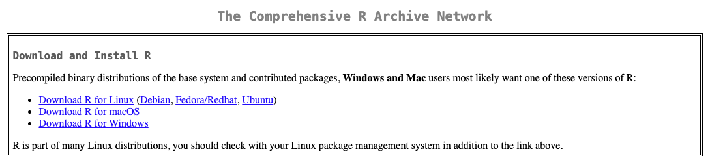

# Installing R and RStudio
 
 Before you can truly begin your data science journey, you will need to install
 R and the (almost!) mandatory RStudio application. 

## Installing R

 The R installer can be downloaded from CRAN (the Comprehensive R Archive
 Network) at the following link:

 [https://cran.r-project.org/](https://cran.r-project.org/).

 You should select the relevant option for your operating system out of the
 options presented at the top of the page. 

 

## Installing RStudio

RStudio is an application which makes it easier to write R code by providing
visual aides. It is a type of application known as an Integrated Development
environment (IDE) and is incredibly popular amongst R programmers. RStudio can
be downloaded from the following link:

[https://posit.co/downloads/](https://posit.co/downloads/)

